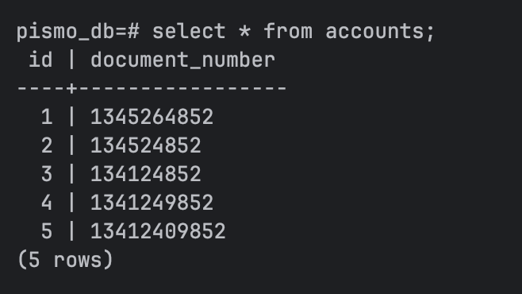
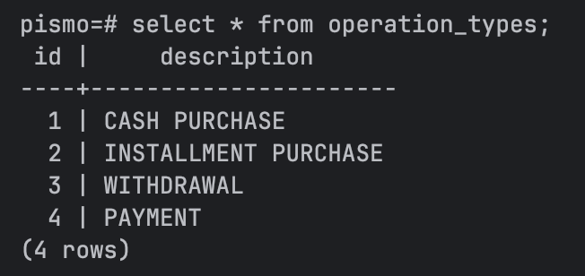
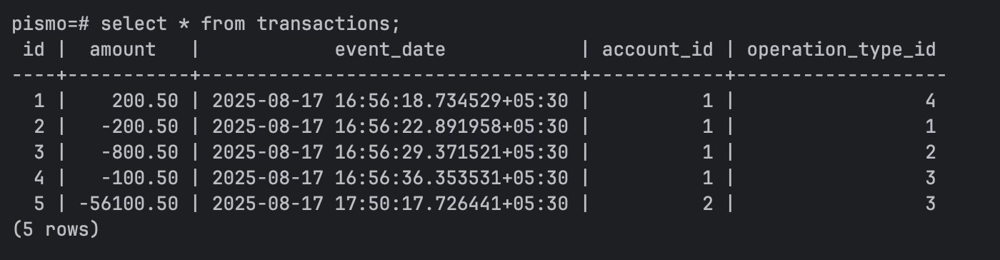

# 🚀 Pismo Transaction Service

A Spring Boot application for managing Accounts and Transactions with PostgreSQL, following clean architecture and REST API standards.

---

## 📚 Tech Stack

- Java 23
- Spring Boot 3.5.4
- Spring Data JPA
- PostgreSQL 16
- Docker & Docker Compose
- Swagger UI (springdoc-openapi)

---

## ⚡ Features

- Create and fetch accounts by document number
- Create and fetch transactions for accounts
- Validations on API request payloads
- API documentation with Swagger UI

---

## 🔗 API Endpoints

| Method | Endpoint                     | Description                      |
|--------|------------------------------|----------------------------------|
| POST   | `/accounts`                   | Create a new account            |
| GET    | `/accounts/{id}`              | Fetch account details by ID     |
| POST   | `/transactions`               | Create a transaction            |

---

## 1️⃣ Create Account

Request

POST /accounts
Content-Type: application/json

{
"documentNumber": "12345678900"
}

Response

{
"accountId": 1,
"documentNumber": "12345678900"
}

## 2️⃣ Fetch Account by ID

Request

GET /accounts/1

Response

{
"accountId": 1,
"documentNumber": "12345678900"
}

## 3️⃣ Create Transaction

Request

POST /transactions
Content-Type: application/json

{
"accountId": 1,
"operationTypeId": 4,
"amount": 200.50
}

Response

{
"transactionId": 1,
"accountId": 1,
"operationTypeId": 4,
"amount": 200.50,
"eventDate": "2025-08-13T14:32:10"
}

---

## 🗄 Database Schema

### Accounts

### Operation Types

### Transactions

---

## 🏗 System Architecture
### flowchart TD
A[Client / Postman] --> |REST API| B[Spring Boot App]
B --> C[(PostgreSQL Database)]
B --> D[(Redis Cache)]
B --> E[Swagger UI Docs]

    C <--> B
    D <--> B

Client → sends API requests

Spring Boot App → processes accounts & transactions

PostgreSQL → stores persistent data

Redis → caches frequently accessed queries (e.g., accounts, operation types)

Swagger UI → interactive API documentation

---

# Clone repository
cd Pismo_Transaction_Service

git clone https://github.com/nikhil699/Pismo_Transaction_Service.git

#

# Build
mvn clean install

mvn spring-boot:run

App → http://localhost:8080

#

➡️ Swagger UI:
http://localhost:8080/swagger-ui/index.html#/

#

## Run with Docker

docker-compose up --build

### Database Setup

#
-- Connect to DB

docker exec -it pismo_transaction-db-1 psql -U postgres -d pismo_db

#
-- View Tables

\dt
#
-- Insert master data for Operation Types table if its not there.

INSERT INTO operation_types (id, description) VALUES
(1, 'CASH PURCHASE'),
(2, 'INSTALLMENT PURCHASE'),
(3, 'WITHDRAWAL'),
(4, 'PAYMENT');
#
-- Check Accounts

SELECT * FROM accounts;
#
-- Check Transactions

SELECT * FROM transactions;
#
-- Check Operation Types

SELECT * FROM operation_types;

#

### ❤️ Developed By

Nikhil Chaurasiya
Built with passion for clean architecture, scalability, and performance.